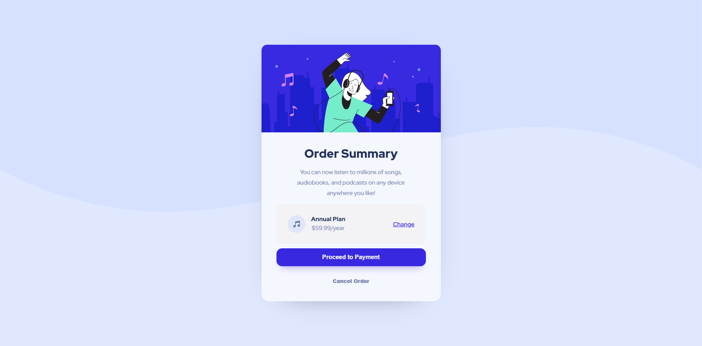

# Frontend Mentor - Order summary card solution

This is a solution to the [Order summary card challenge on Frontend Mentor](https://www.frontendmentor.io/challenges/order-summary-component-QlPmajDUj). Frontend Mentor challenges help you improve your coding skills by building realistic projects.

## Table of contents

- [Overview](#overview)
  - [The challenge](#the-challenge)
  - [Screenshot](#screenshot)
  - [Links](#links)
- [My process](#my-process)
  - [Built with](#built-with)
  - [What I learned](#what-i-learned)
  - [Continued development](#continued-development)
- [Author](#author)

## Overview

### The challenge

Users should be able to:

- See hover states for interactive elements

### Screenshot




### Links

- Solution URL: [Add solution URL here](https://your-solution-url.com)
- Live Site URL: [Add live site URL here](https://your-live-site-url.com)

## My process

### Built with

- Semantic HTML5 markup
- CSS custom properties
- Flexbox

### What I learned

```css
@media screen and (max-width: 490px) {
  .container {
    min-width: 18rem;
    max-width: 20rem;
    min-height: 37rem;
  }
}

@media screen and (max-width: 490px) {
  main {
    padding: 0 20px;
    gap: 20px;
  }

  .main__div-order {
    padding: 0 5px;
    padding-top: 30px;
    padding-bottom: 5px;
    text-wrap: pretty;
  }

  h1 {
    font-size: 1.55rem;
  }

  .main__div-price {
    padding: 15px;
  }

  .main__div-price-btns {
    justify-content: stretch;
    margin-bottom: 0;
    gap: 30px;
  }
}
```

## Author

- Frontend Mentor - [@yourusername](https://www.frontendmentor.io/profile/yourusername)
